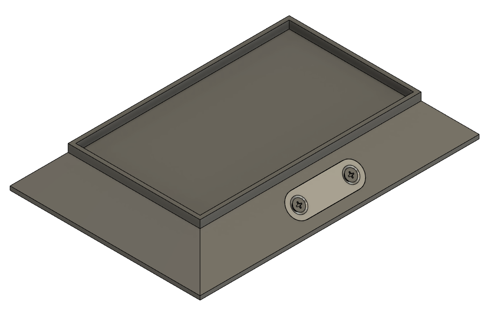
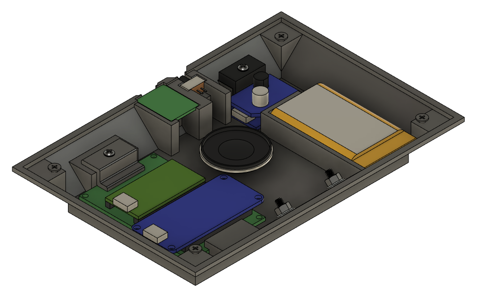

# Bobblehead-Stand
This project is a bobblehead stand, which plays audio files to make the bobbleheads seem like they're talking.

## Components Used
- Adafruit Audio FX Soundboard + 2x2W Amp - WAV/OGG Trigger - 16MB Flash
- 8 Ohm 2W mini speaker
- Teensy LC Microcontroller
- Lipo Charge Board With Protection Circuit
- 5V 1A Step-Up Converter
- 3.7V 1200mAh Lipo Battery
- 3d Printed Case
- Small Wires, Switches, Etc.

## How The Device Works
On boot, the system plays the first file stored in the FX Module. This allows you to play a startup file to indicate to the user that the device is ready to be used. After this, you can tap the metal bar on the front of the device to randomly play any of the files stored in the device, excluding the first file (Since it's only for startup).

> Note:  
> When uploading files to the FX Board's Micro USB port, note that they are ordered based on when the file was copied to the device. With that being said, the startup file should always be copied first by itself, followed by copying the rest of the files you want to play at random. 

Touch input is detected though one of the Teensy pins that support hardware-based capacitive touch sensing. The Teensy LC communicates with the Adafruit FX Module using UART and the Adafruit_Soundboard_Library.

You are able to charge the device using a Micro USB port on the back of the case and are able to electrically disconnect the charge/protection circuit from the Step-Up converter to save power.

## Pictures
Top View

Bottom View
